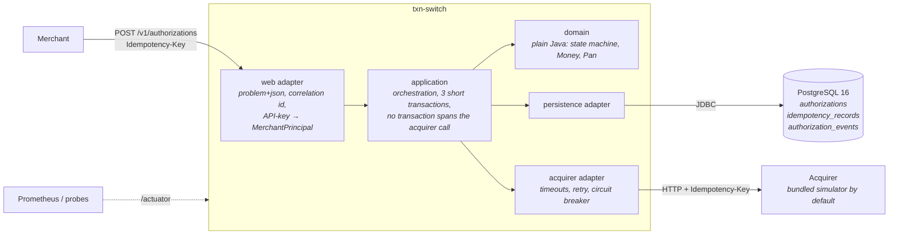
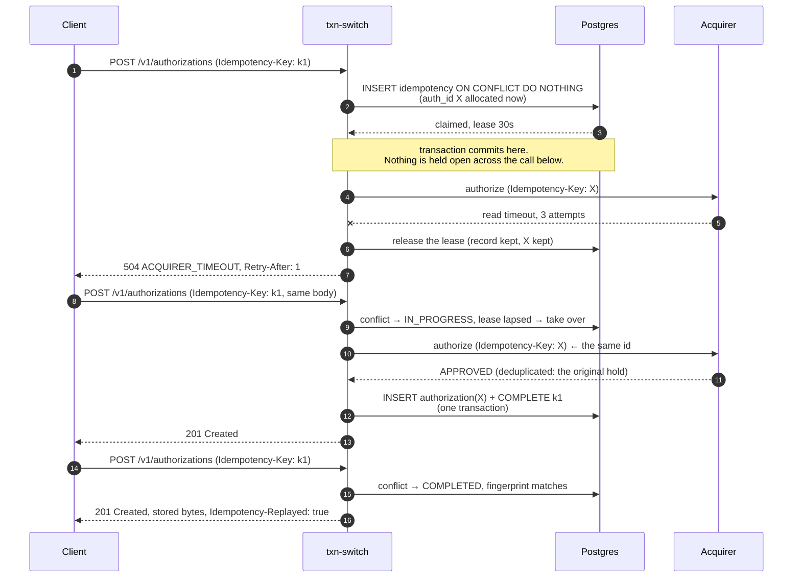
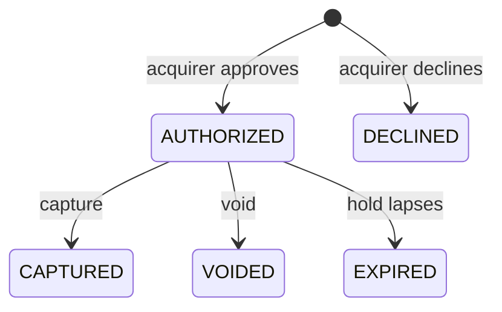

# txn-switch

A card **authorization switch**: a REST service that accepts payment authorization requests
from merchants, routes each one to a downstream acquirer, and owns the lifecycle of the
resulting authorization. The interesting part is not the happy path — that is an insert and
an HTTP call — but everything around it: the same request arriving twice because a client
retried, the same request arriving fifty times at once, an acquirer that answers slowly or
not at all or after we have given up, and this process dying between "the acquirer approved"
and "we wrote it down". Every design decision here serves one invariant: **a merchant that
sends the same authorization request N times gets at most one authorization, and at most one
hold on the cardholder's funds.** The rest of this README is about how that is arranged and
how you can check it yourself.

---

## Run it

```bash
docker compose up
```

That starts Postgres 16 and the service. Flyway migrates on startup, the app waits for a
healthy database, and its own healthcheck reports ready only when it can serve. Then:

```bash
curl -si -X POST http://localhost:8080/v1/authorizations \
  -H 'Authorization: Bearer sk_local_demo' \
  -H 'Idempotency-Key: demo-key-0001' \
  -H 'Content-Type: application/json' \
  -d '{"merchantReference":"order-1234","amount":1250,"currency":"USD",
       "card":{"pan":"4111111111111111","expiryMonth":12,"expiryYear":2030}}'
```

Send it a second time with the same `Idempotency-Key` and you get the original response
back, byte for byte, with `Idempotency-Replayed: true`.

Interactive API docs are at `http://localhost:8080/swagger-ui.html`.

---

## Architecture



The domain has no Spring and no JPA annotations. That is not a style preference: it is what
lets `Authorization` refuse to exist without an acquirer decision, and it is checked by a
test that reads the compiled class files (`DomainPurityTest`), not by convention.

---

## The idempotent retry

This is the sequence that the whole design exists to make safe. The acquirer approves, the
answer never reaches us, and the client retries.



Three things make that work, and losing any one of them reintroduces a double charge:

1. **The authorization id is allocated before anything is sent downstream** and is used as
   the acquirer's own idempotency key. This is why a read timeout is safe to retry at all.
2. **A failed attempt releases its lease rather than deleting the record.** Deleting it
   would free the pre-allocated id, and the retry would create a second hold.
3. **The authorization row and the completed claim are written in one transaction.** There
   is no instant at which a charge exists without the record that stops it happening twice.

---

## API

All `/v1` endpoints require `Authorization: Bearer <api-key>`. Amounts are **integers in the
currency's minor units** — `1250` with `"currency": "USD"` is USD 12.50, and a fractional
amount is rejected rather than rounded.

| Method | Path | Required headers | Success | Notable failures |
|---|---|---|---|---|
| `POST` | `/v1/authorizations` | `Authorization`, `Idempotency-Key` | `201` + `Location`; a replay returns the original status with `Idempotency-Replayed: true` | `401`, `400` validation, `422` key reuse, `409` key in progress, `503`/`504` acquirer |
| `GET` | `/v1/authorizations/{id}` | `Authorization` | `200` | `401`, `404` |
| `POST` | `/v1/authorizations/{id}/capture` | `Authorization` | `200` | `401`, `404`, `409` illegal transition or expired, `422` partial capture |
| `POST` | `/v1/authorizations/{id}/void` | `Authorization` | `200` | `401`, `404`, `409` |
| `GET` | `/actuator/health/liveness` · `/readiness` | — | `200` | readiness `503` when Postgres is unreachable |
| `GET` | `/actuator/prometheus` | — | `200` | |
| `GET` | `/swagger-ui.html` · `/v3/api-docs` | — | `200` | |
| `POST` | `/__simulator/acquirer/config` | — | `200` | simulator only; `SIMULATOR_ENABLED=false` removes it |

### Lifecycle



Every other transition is refused with `409 INVALID_STATE_TRANSITION`, and the refusal
carries `currentStatus` so a client does not need a follow-up `GET`. The rule lives in the
aggregate, not the controller. There is deliberately **no `FAILED` status**: an
`Authorization` row exists only when the acquirer gave a definitive answer, so nothing in
that table can be mistaken for a hold that was never placed.

**A decline is not an error.** It returns `201 Created` with `"status": "DECLINED"`: the
attempt is a resource that exists, is addressable, and replays under its key. The `402`
alternative and why it was rejected are in [ADR-0003](docs/adr/0003-error-contract.md).

### Test cards

The bundled simulator routes on card number, the way real sandboxes do, because a test that
depends on a random failure rate fails on someone else's machine at some other time.

| PAN | Behaviour |
|---|---|
| `4111111111111111` | approve |
| `4000000000000002` | decline, `DO_NOT_HONOR` |
| `4000000000009995` | decline, `INSUFFICIENT_FUNDS` |
| `4000000000000119` | two gateway errors, then approve — proves the retry recovers |
| `4000000000000259` | one call that sleeps past the read timeout, then approves |
| `4000000000000101` | a malformed-request answer, which must not be retried |

Latency and failure rate can also be injected at runtime for a demonstration:

```bash
curl -X POST http://localhost:8080/__simulator/acquirer/config \
  -H 'Content-Type: application/json' -d '{"latencyMillis":2000,"failureRate":0.0}'
```

---

## Errors

Every failure is an RFC 9457 problem document with a stable, machine-readable `code`. The
normative catalogue — every code, its status, whether retrying helps, and whether the retry
may reuse the same `Idempotency-Key` — is in **[docs/errors.md](docs/errors.md)**, and each
`type` URI dereferences to its entry there.

```json
{
  "type": "https://github.com/addiiiooo/txn-switch/blob/main/docs/errors.md#idempotency_key_reuse",
  "title": "Idempotency key reused with a different request",
  "status": 422,
  "detail": "Idempotency-Key 'k-2f81' was first used for a different request",
  "code": "IDEMPOTENCY_KEY_REUSE",
  "correlationId": "1f0c8b52-7b9a-4a1e-9a0e-2d0a3c7b4e11"
}
```

`ErrorCatalogueTest` parses `docs/errors.md` and fails the build if a code is missing from
either side, or if the documented status disagrees with the one the service actually
returns. A documented catalogue that nothing checks is wrong within a month, and clients
write their retry logic against it.

---

## Concurrency guarantees, and how they are tested

**The guarantee.** For a given `(merchant, Idempotency-Key)`, at most one authorization is
ever created and at most one hold is ever placed at the acquirer — whatever the arrival
pattern, and whether or not this process survives the attempt.

**How it is arranged.** One hard constraint drives everything: *no database transaction may
span the acquirer call.* A `SELECT ... FOR UPDATE` held across a network round trip pins a
pooled connection for its duration, and with fifty concurrent duplicates the connection pool
fails before the acquirer does — the symptom would be a `500` from a connection timeout
rather than the correct, boring `409`. So:

| Race | Mechanism | Why |
|---|---|---|
| N identical authorizations | `UNIQUE (merchant_id, idempotency_key)`, insert-wins | Postgres already serialises this perfectly; an application lock on top would be ceremony |
| Capture vs void on one authorization | JPA `@Version` optimistic locking | Contention is an anomaly, not a workload; the loser re-reads and the state machine turns the race into a truthful `409` instead of a lost update |
| A crashed or timed-out attempt | A lease on the claim, taken over by a conditional `UPDATE` | The update *is* the test, so exactly one caller can win |
| Background sweeps | `FOR UPDATE SKIP LOCKED` | A second instance takes different rows; no leader election |

**How it is tested.** `ConcurrentAuthorizationIT` releases 50 threads on one latch against a
single key and then asserts on outcomes rather than on thread scheduling:

* exactly **one** row in `authorizations`,
* exactly **one** execution at the acquirer (the simulator counts distinct keys),
* exactly **one** response that created something — every other response is either a replay
  of those same bytes or `409 IDEMPOTENCY_REQUEST_IN_PROGRESS`,
* and a sequential retry afterwards replays the original body byte for byte.

Asserting "one 201 and forty-nine 409s" would be asserting the thread scheduling of the
machine running the test; it would pass here and fail on a slower box for no good reason.
A second test fires 50 *distinct* requests and asserts all 50 are created, because
deduplication that collapses genuinely different requests is the other way to fail.

The crash case has its own test: `IdempotencyReplayIT` plants an abandoned claim with a
lapsed lease and no authorization row, then asserts the retry takes it over and returns an
authorization whose id **is the pre-allocated one** — a direct check that a takeover
re-drives the same downstream identifier rather than allocating a new one.

---

## Resilience

| Knob | Value | Reasoning |
|---|---|---|
| connect timeout | 300 ms | a slow connect is a dead host, not a busy one |
| read timeout | 800 ms per attempt | the retry budget multiplies this |
| attempts | 3 | worst case ≈ 2.5 s, which is the number the 30 s lease is set against |
| backoff | 50 ms base, ×2, ±50 % jitter, capped at 400 ms | without jitter, N clients that failed together retry together |
| retried | connect/read timeouts, `502`/`503`/`504`, `429` | safe **only** because every call carries the pre-allocated authorization id as the acquirer's idempotency key |
| never retried | declines, `400`/`401`/`422`, open breaker | a decline is an answer; retrying a bad request just burns the budget |
| breaker | count window 20, min 10 calls, 50 % failure or slow-call rate at 1 s, 10 s open, 3 half-open calls | opens in about ten calls, probes every ten seconds |

Decorator order is `Retry(CircuitBreaker(call))` — Resilience4j's default, made explicit
because it is load-bearing. Every attempt is recorded by the breaker, so an outage opens it
in about ten calls rather than thirty; and `CallNotPermittedException` is excluded from the
retry predicate, so an open breaker fails in microseconds instead of sleeping through three
useless backoffs. `AcquirerFailureApiIT` asserts that an open breaker answers without any
call leaving the process, and in under 500 ms.

Connect failures and read timeouts are deliberately not collapsed into one exception: a
connect failure means nothing was sent, a read timeout means it may have been, and that
difference decides whether a hold can be pending at the acquirer.

---

## Observability

* **Correlation id** — `X-Correlation-Id` is honoured or generated, returned on the
  response, written onto every log line, stored on the audit row, forwarded to the acquirer,
  and included in every problem document.
* **Probes** — `/actuator/health/readiness` includes the database, `/actuator/health/liveness`
  deliberately does not: restarting a healthy process will not bring a database back.
  `ReadinessProbeIT` proves the difference by stopping a container.
* **Metrics** (`/actuator/prometheus`), all low-cardinality — no merchant id, nothing from
  the request body:

| Metric | What it tells you |
|---|---|
| `txnswitch_authorization_requests_total{outcome,replay}` | volume by outcome, and how much of it is replays |
| `txnswitch_authorization_duration_seconds` | end-to-end latency histogram with SLO buckets |
| `txnswitch_acquirer_call_duration_seconds{operation,result}` | one attempt against the acquirer |
| `txnswitch_idempotency_conflicts_total{kind}` | repeated keys that were not plain replays |
| `resilience4j_circuitbreaker_state{name="acquirer"}` | breaker state without reading the logs |
| `txnswitch_unresolved_attempts` | **should be zero** — claims that reached the acquirer and were never resolved (see *Out of scope*) |

---

## Card data and authentication

The PAN is accepted, validated, forwarded to the acquirer, and then discarded. What is
persisted is the **BIN (first six) and the last four** — the truncation PCI DSS permits —
plus brand, expiry, and an HMAC-SHA256 fingerprint with a key from the environment. A bare
SHA-256 of a sixteen-digit number is a lookup table away from being the number again, which
is why the digest is keyed.

`PanLeakageIT` states this as a property rather than a habit: after a real authorization, the
full number appears in no captured log line (with the root logger turned up to DEBUG), in no
response body, and in no column of any row — the database check casts whole rows to text, so
a column added next year is covered without anyone remembering to update the test. That test
found a real leak on its first run: Spring's message converters log the object they are about
to write at DEBUG, which printed the card number. The fix was `SensitivePan`, a wrapper whose
`toString()` is masked, so the safe behaviour is structural rather than a convention.

Authentication resolves an API key to a merchant: keys are hashed once at startup and looked
up by hash, so there is no linear scan and no timing oracle. **There is no `X-Merchant-Id`** —
a header the caller sets is not a trust boundary. Another merchant's authorization is a `404`
rather than a `403`, because confirming existence across tenants is itself a leak. What this
is not, and what real authentication would look like, is in *Out of scope*.

---

## Design decisions and trade-offs

Each ADR states what was decided, what it costs, what was rejected, and which tests prove it.

| # | Decision | The uncomfortable part |
|---|---|---|
| [0001](docs/adr/0001-idempotency.md) | Idempotency via a claimed key, a request fingerprint and a lease | A retry inside the lease window gets a `409`, not the winner's answer |
| [0002](docs/adr/0002-locking-strategy.md) | Unique-constraint arbitration for creation, optimistic locking for transitions | Correctness of concurrent captures depends on the *downstream* idempotency key |
| [0003](docs/adr/0003-error-contract.md) | RFC 9457 problem documents with a stable code | A decline is `201 DECLINED`, not `402` |
| [0004](docs/adr/0004-resilience-policy.md) | Timeouts, bounded jittered retries, circuit breaker | Read timeouts are retried — safe only because the acquirer deduplicates |
| [0005](docs/adr/0005-money-representation.md) | Minor units in a `long` + ISO-4217 currency | A fractional `amount` is rejected, never rounded |
| [0006](docs/adr/0006-layering.md) | Pure domain, three ports, no gratuitous interfaces | About 150 lines of hand-written mappers, paid on purpose |

[`PLAN.md`](PLAN.md) has the design in full, including the failure-mode matrix.

---

## Building and testing

```bash
./mvnw verify
```

Runs unit tests, integration tests against real Postgres containers, and the **85 % line
coverage gate**, which is bound to `verify` and fails the build below the threshold.
Formatting (Spotless with google-java-format) is checked at `validate`, so drift fails
locally rather than only in CI. GitHub Actions runs the same thing plus a Docker image build
on every push.

Integration tests need a working Docker daemon. To reuse the Postgres container between
runs, opt in the way Testcontainers requires:

```bash
echo 'testcontainers.reuse.enable=true' >> ~/.testcontainers.properties
```

Test layout, and what each layer is for:

| Suite | What it is for |
|---|---|
| Domain unit tests | The state machine, exhaustively: every status against every operation. No Spring, milliseconds. |
| `DomainPurityTest` | Reads the compiled classes and fails if a framework type appears in the domain. |
| Persistence ITs | The unique constraint, the version check, `SKIP LOCKED`, and a round trip that preserves every field. |
| API ITs | The endpoint table, the error catalogue, the replay contract, tenant isolation. |
| `ConcurrentAuthorizationIT` | The 50-way stampede. |
| `AcquirerResilienceIT`, `AcquirerFailureApiIT` | One test per resilience behaviour, driven through real HTTP. |
| `PanLeakageIT` | Logs, responses, and every database column. |

---

## Configuration

Everything is an environment variable with a working local default; no secrets are
committed. `DB_URL`, `DB_USERNAME`, `DB_PASSWORD`, `DB_POOL_SIZE`, `SERVER_PORT`, `ACQUIRER_NAME`,
`ACQUIRER_BASE_URL`, `ACQUIRER_CONNECT_TIMEOUT`, `ACQUIRER_READ_TIMEOUT`,
`ACQUIRER_MAX_ATTEMPTS`, `SIMULATOR_ENABLED`, `AUTH_HOLD_TTL`, `SUPPORTED_CURRENCIES`,
`IDEMPOTENCY_TTL`, `IDEMPOTENCY_LEASE_TTL`, `IDEMPOTENCY_UNRESOLVED_GRACE`, `API_KEYS`,
`CARD_FINGERPRINT_KEY`, `PROBLEM_TYPE_BASE_URI`.

The two development credentials (`sk_local_demo` and the fingerprint key) are published on
purpose and the application logs a warning at startup if either is still in use outside the
`local` profile.

---

## Out of scope

Deliberate omissions, with the two that a payments reviewer will look for stated in full.

**Reversal of unknown-outcome attempts.** If the acquirer approves a hold and the answer
never reaches us, that hold leaks until the issuer expires it. The fix is a sweeper that
claims idempotency records still `IN_PROGRESS` with `downstream_attempted = true` and a
lapsed lease (`FOR UPDATE SKIP LOCKED`), sends a reversal for the pre-allocated
authorization id — which the acquirer already knows, so the reversal is itself idempotent —
and completes the record with a terminal error so the key cannot be reused. It is not built.
The exposure is instead **measured**: `txnswitch_unresolved_attempts` counts exactly those
records and should be zero. An unmeasured gap is a lie; a measured one is a backlog item.

**Real authentication.** The API-key map is a genuine trust boundary but a primitive one: no
rotation, no scopes, no expiry, no revocation without a restart, and the keys sit in the
process environment. Production would put Spring Security with OAuth2 client credentials or
mTLS behind the same `MerchantPrincipal` seam, which is why the seam exists.

Also out of scope: settlement and clearing · refunds · partial and multiple capture ·
multi-acquirer routing and failover · real acquirer protocols (ISO 8583, scheme APIs) ·
rate limiting · 3-D Secure, CVV handling, tokenisation · fraud scoring · webhooks ·
multi-region deployment · PCI-DSS compliance as such (the posture above is hygiene, not
certification).

Two simplifications worth naming, because they are the kind of thing that looks like an
oversight: the bundled simulator acknowledges a capture and a void for the same
authorization without enforcing its own state machine — the local state machine still
yields exactly one outcome, but a real acquirer would refuse the second one; and the
circuit breaker is per-process, so five instances need five outages' worth of failed calls
to all open.

**No performance numbers appear anywhere in this repository**, because no benchmark was run.
The timeout and breaker values are calibrated against a loopback simulator, not against a
real acquirer; they are configuration, and they would need measuring against a real one.

---

## Licence

MIT. See [LICENSE](LICENSE).
