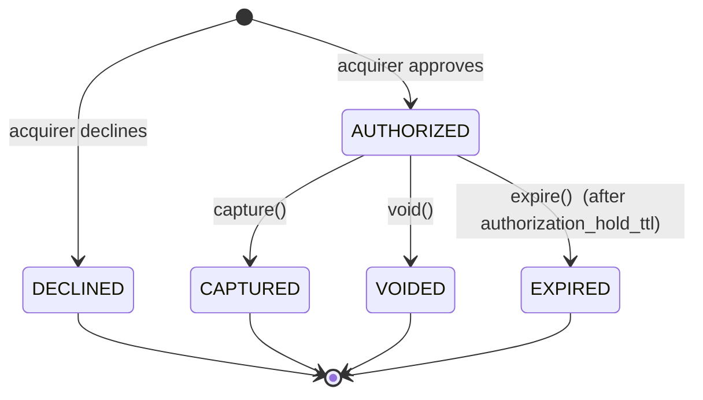
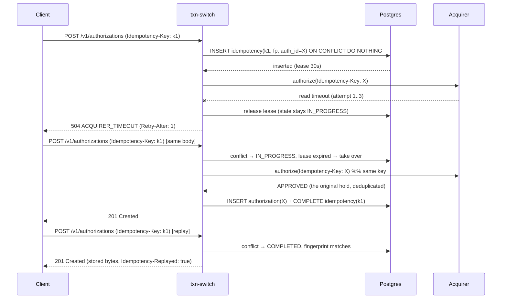

# txn-switch — design plan

Status: **draft for review**. No production code has been written yet.
Author: Aditya Sumanth · Date: 2026-09-23

---

## 0. What this is

`txn-switch` is a card **authorization switch**: a REST service that accepts payment
authorization requests from merchants, routes each one to a downstream acquirer, and owns
the lifecycle of the resulting authorization (capture / void / expiry).

The entire value of a switch is in what it does when things go wrong. A happy-path
authorization is a database insert and an HTTP call; the engineering is in the rest:

* the same request arriving twice (client retry, load-balancer retry, user double-click),
* the same request arriving **fifty times at once**,
* the acquirer answering slowly, not at all, or after we gave up,
* our own process dying between "the acquirer approved" and "we wrote it down".

Every design decision below is chosen to make one invariant hold:

> **A merchant that sends the same authorization request N times gets at most one
> authorization, and at most one hold on the cardholder's funds.**

Everything else — the state machine, the error catalogue, the metrics — is in service of
being able to *prove* that, and to *see* it when it breaks.

---

## 1. Domain model

### 1.1 Aggregates and value objects

The domain package contains no Spring and no JPA annotations (enforced by a test — §7.1).

| Type | Kind | Notes |
|---|---|---|
| `Authorization` | aggregate root | Owns the state machine. All transitions are methods on it. |
| `AuthorizationId` | value object | UUIDv7 — time-ordered, so the primary-key index stays append-friendly. |
| `AuthorizationStatus` | enum | `AUTHORIZED`, `DECLINED`, `CAPTURED`, `VOIDED`, `EXPIRED`. |
| `Money` | value object | `long minorUnits` + `java.util.Currency`. See ADR-0005. |
| `Pan` | value object | Luhn-checked, 12–19 digits. **Never persisted, never logged.** `toString()` is masked. |
| `CardDetails` | value object | What we *do* keep: BIN (first 6), last 4, brand, expiry, HMAC fingerprint. |
| `AcquirerDecision` | sealed interface | `Approved` \| `Declined`, pattern-matched so a new outcome breaks compilation rather than falling through a default branch. A failure to *obtain* a decision is not a member: it is a typed exception, which keeps "we know the answer" and "we do not" in different types and lets Resilience4j's predicates work on exceptions in the usual way. |
| `AuthorizationEvent` | value object | Append-only audit record of one transition. |
| `IdempotencyRecord` | aggregate root | The dedup ledger. See §3. |

`Authorization` has no public constructor. It is created only by
`Authorization.authorize(...)` / `declined(...)` factory methods that take the acquirer
decision, so an `Authorization` cannot exist without a downstream answer.

### 1.2 State machine



Rules, enforced in `Authorization`, not in the controller:

* Any transition not drawn above throws `IllegalTransitionException(from, to)`, which the
  web layer maps to `409 INVALID_STATE_TRANSITION` with the current status in the problem
  body. Capturing twice, voiding a captured authorization, capturing a decline — all 409.
* `capture(Instant now)` and `void(Instant now)` take the clock and reject an
  authorization whose `expiresAt` has passed, **even if the expiry sweeper has not run
  yet**. The sweeper is an optimisation for reporting, never the source of truth.
* There is deliberately **no `FAILED` status**. An `Authorization` row exists only when
  the acquirer gave a definitive answer. An attempt with an unknown outcome lives in the
  idempotency ledger, not in the authorization table (§3.4) — otherwise a timeout would
  leave a row that looks like a payment but is not one.
* Partial capture is not supported. A capture carrying an `amount` different from the
  authorized amount is rejected with `422 PARTIAL_CAPTURE_NOT_SUPPORTED` rather than
  silently capturing the full amount.

### 1.3 Persistence schema

Three tables, one Flyway migration (`V1__initial_schema.sql`). All timestamps are
`TIMESTAMPTZ`; status columns are `VARCHAR` + `CHECK` rather than Postgres enums, because
adding a value to a PG enum is a migration that cannot run inside some transactions. Table
names are plural because `authorization` is a reserved word in standard SQL and Postgres
will not accept it unquoted.

**`authorizations`**

| column | type | notes |
|---|---|---|
| `id` | `uuid` PK | UUIDv7, allocated *before* the acquirer call (§3.3) |
| `merchant_id` | `varchar(64)` | stands in for an authenticated principal (§10) |
| `merchant_reference` | `varchar(128)` | merchant's own order id, not unique |
| `amount_minor` | `bigint` | `CHECK (amount_minor > 0)` |
| `currency` | `char(3)` | ISO-4217 alpha |
| `status` | `varchar(16)` | `CHECK (status IN (...))` |
| `card_bin`, `card_last4`, `card_brand`, `card_exp_month`, `card_exp_year` | | first 6 + last 4 only — the truncation PCI DSS explicitly permits. The middle digits are never written anywhere |
| `card_fingerprint` | `char(64)` | HMAC-SHA256(PAN), key from env |
| `acquirer_name`, `acquirer_reference`, `approval_code` | | |
| `decline_code`, `decline_message` | | null unless `DECLINED` |
| `created_at`, `updated_at`, `expires_at`, `captured_at`, `voided_at` | `timestamptz` | |
| `version` | `bigint` | optimistic lock (ADR-0002) |

Indexes: PK on `id`; `(merchant_id, created_at DESC)`; a **partial** index
`(expires_at) WHERE status = 'AUTHORIZED'` so the expiry sweeper never scans terminal rows.

**`idempotency_records`**

| column | type | notes |
|---|---|---|
| `id` | `uuid` PK | |
| `merchant_id` + `idempotency_key` | `varchar` | **`UNIQUE (merchant_id, idempotency_key)`** — the single arbitration point of the whole system |
| `request_fingerprint` | `char(64)` | SHA-256 of canonical request (ADR-0001) |
| `authorization_id` | `uuid` | pre-allocated; also the acquirer's dedup key |
| `state` | `varchar(16)` | `IN_PROGRESS` \| `COMPLETED` |
| `lease_expires_at` | `timestamptz` | crash recovery (§3.4) |
| `attempts` | `int` | |
| `downstream_attempted` | `boolean` | may bytes have reached the acquirer? Set when the key is claimed, since a claim is only taken in order to send, and cleared only when the call provably never left the process. Drives the unresolved-attempt gauge (§3.7) |
| `response_status` | `int` | stored verbatim for replay |
| `response_body` | `text` | **`text`, not `jsonb`** — we replay the exact bytes we sent the first time; `jsonb` normalises key order and whitespace, so a replay would not be byte-identical |
| `created_at`, `expires_at` | `timestamptz` | 24h TTL |

Indexes: the unique pair; `(state, lease_expires_at)` for takeover/sweep; `(expires_at)`
for purge.

**`authorization_events`** — append-only audit trail: `id`, `authorization_id`,
`type`, `from_status`, `to_status`, `correlation_id`, `created_at`, `detail` (text).
Never updated, never deleted. Cheap to write, and the first thing anyone asks for when a
merchant disputes what happened.

---

## 2. API surface

Base path `/v1`. Media types: `application/json` in, `application/json` out,
`application/problem+json` for every error (ADR-0003).

| Method | Path | Required headers | Success | Notable failures |
|---|---|---|---|---|
| `POST` | `/v1/authorizations` | `Authorization: Bearer`, `Idempotency-Key` | `201` + `Location`; replay → original status + `Idempotency-Replayed: true` | `401`, `400` validation, `422` key reuse, `409` key in progress, `503/504` acquirer |
| `GET` | `/v1/authorizations/{id}` | `Authorization: Bearer` | `200` | `401`, `404` |
| `POST` | `/v1/authorizations/{id}/capture` | `Authorization: Bearer` | `200` | `401`, `404`, `409` illegal transition / expired, `422` partial capture |
| `POST` | `/v1/authorizations/{id}/void` | `Authorization: Bearer` | `200` | `401`, `404`, `409` |
| `GET` | `/actuator/health/liveness` \| `/readiness` | — | `200` / `503` | readiness fails when Postgres is unreachable |
| `GET` | `/actuator/prometheus` | — | `200` | |
| `GET` | `/v3/api-docs`, `/swagger-ui.html` | — | `200` | springdoc |
| `POST` | `/__simulator/acquirer/config` | — | `200` | demo-only, flag-guarded (§4.1) |

Every `/v1` request carries `Authorization: Bearer <api-key>`. The merchant identity is
**derived from the credential** (§10.1); there is no header a caller can set to become
another merchant. `/actuator/**` and `/__simulator/**` are deliberately unauthenticated.

Authorize request:

```json
{
  "merchantReference": "order-1234",
  "amount": 1250,
  "currency": "USD",
  "card": { "pan": "4111111111111111", "expiryMonth": 12, "expiryYear": 2030 }
}
```

`amount` is **minor units as an integer** (1250 = USD 12.50). A JSON number with a
decimal point is rejected at parse time rather than rounded (ADR-0005).

Authorize response (`201`):

```json
{
  "id": "0199c3f1-...-7a41",
  "status": "AUTHORIZED",
  "amount": 1250,
  "currency": "USD",
  "merchantId": "m_demo",
  "merchantReference": "order-1234",
  "card": { "brand": "VISA", "bin": "411111", "last4": "1111", "expiryMonth": 12, "expiryYear": 2030 },
  "acquirer": { "name": "sim-acquirer", "reference": "ACQ-7F3C21", "approvalCode": "A1B2C3" },
  "createdAt": "2026-09-23T10:15:00Z",
  "expiresAt": "2026-09-30T10:15:00Z"
}
```

### 2.1 A decline is not an error

An acquirer decline returns **`201 Created` with `"status": "DECLINED"`** and a
`decline` object — not `402`, not a problem document. Rationale: the authorization
attempt is a resource that exists, is addressable at its `Location`, and is replayable
under the same idempotency key. Problem documents are reserved for requests we could not
*process*. This is the Adyen/ISO-8583 `resultCode` model rather than the Stripe
`402 card_declined` model; the trade-off is recorded in ADR-0003 because it is the kind of
thing a reviewer will want an answer for.

### 2.2 Error catalogue

Full table with machine-readable codes, HTTP statuses and retry semantics lives in
[`docs/errors.md`](errors.md). Every problem document carries `type`, `title`,
`status`, `detail`, `code`, `correlationId`, and — where relevant — `errors[]`,
`currentStatus`, `retryAfter`.

---

## 3. Concurrency and idempotency strategy

This is the core of the project. ADR-0001 and ADR-0002 carry the decisions; this section
is the mechanism.

### 3.1 The constraint that drives everything

The acquirer call is network I/O that can take seconds. Therefore **no database
transaction may span the acquirer call**. A `SELECT ... FOR UPDATE` held across an HTTP
round trip pins a pooled connection for the duration; with a pool of 10 and 50 concurrent
duplicates, the pool — not the acquirer — becomes the failure. Everything below follows
from refusing to do that.

### 3.2 Three transactions, one HTTP call

```
T1  (short)   claim the idempotency key           -- INSERT ... ON CONFLICT DO NOTHING
              ↓ commit
    (no tx)   call the acquirer                   -- retries, breaker, timeouts
              ↓
T2  (short)   INSERT authorization
              + UPDATE idempotency_record → COMPLETED (status + body)
              + INSERT authorization_event
              ↓ commit (atomic: the row and the stored response land together)
```

T1 outcomes:

* **Insert succeeded** → we own the key. Proceed.
* **Conflict, existing row `COMPLETED`** → compare fingerprints.
  * equal → replay the stored status and body verbatim, add `Idempotency-Replayed: true`.
  * different → `422 IDEMPOTENCY_KEY_REUSE`.
* **Conflict, existing row `IN_PROGRESS`, lease live** → `409
  IDEMPOTENCY_REQUEST_IN_PROGRESS` + `Retry-After: 1`. We do *not* block the request
  thread waiting for the winner (ADR-0002 explains why, and what we give up).
* **Conflict, existing row `IN_PROGRESS`, lease expired** → take over (§3.4).

### 3.3 One pre-allocated id, used as the acquirer's idempotency key

T1 allocates the `AuthorizationId` and stores it on the idempotency record *before*
anything is sent downstream. That id is sent to the acquirer as **its** `Idempotency-Key`.

This single decision is what makes the rest safe:

* a **read timeout is retryable**, because a retry carries the same downstream key and the
  acquirer returns the original outcome instead of creating a second hold;
* a **crash takeover** is safe for the same reason;
* the authorization's primary key is a second line of defence: if two flows ever raced to
  T2, the second insert violates the PK.

Without a downstream idempotency key, retrying a read timeout is a double-charge bug. The
plan is explicit about this because it is the single most commonly botched thing in this
class of service.

### 3.4 Leases, crashes and unknown outcomes

`lease_expires_at = now + lease_ttl` (default 30s, deliberately longer than the total
downstream budget of ~2.5s). A request that finds an `IN_PROGRESS` record with an expired
lease takes ownership with a conditional update:

```sql
UPDATE idempotency_record
   SET lease_expires_at = now() + interval '30 seconds', attempts = attempts + 1
 WHERE id = ? AND state = 'IN_PROGRESS' AND lease_expires_at < now()
```

One row updated → we own it; zero rows → someone beat us → `409`.

The same mechanism covers **retryable downstream failures**: rather than deleting the
record (which would release the pre-allocated id and re-open the double-charge hole), we
release the lease and return `503`/`504`. The client's retry with the same key re-acquires
the lease, reuses the same id, and the acquirer deduplicates. One mechanism — the lease —
covers process crashes, timeouts and breaker-open uniformly.

### 3.5 Sequence: idempotent retry after a timeout



### 3.6 Locking choices (summary; ADR-0002 has the argument)

| Path | Mechanism | Why |
|---|---|---|
| Create authorization | Unique constraint on `(merchant_id, idempotency_key)`; insert-wins | Postgres already serialises this perfectly; no application lock, no held connection |
| Capture / void | JPA `@Version` optimistic locking | Contention is rare; the loser re-reads and the state machine turns the race into a correct `409` instead of a lost update |
| Sweepers | `SELECT ... FOR UPDATE SKIP LOCKED LIMIT n` | Lets multiple instances sweep without coordination |
| Rejected | `FOR UPDATE` across the acquirer call | Pins a pooled connection across network I/O (§3.1) |
| Rejected | `SERIALIZABLE` | Buys nothing here, costs retry storms |

### 3.7 Background maintenance

Two `@Scheduled` jobs, each claiming rows with `FOR UPDATE SKIP LOCKED` so more than one
instance is safe:

1. **Expiry** — `AUTHORIZED` past `expires_at` → `EXPIRED` + event.
2. **Purge** — idempotency records past their 24h TTL.

There is a third thing a production switch would do and this one does not: **reverse
unknown-outcome attempts**. If the acquirer approved a hold and the answer never reached
us, that hold leaks until the issuer expires it. Automatic compensation is out of scope
(§12), so instead of pretending the case does not exist, we make it *visible*: a
`txnswitch_unresolved_attempts` gauge counts idempotency records still `IN_PROGRESS` with
`downstream_attempted = true` and a lease expired beyond a grace period. The number should
be zero; if it is not, someone has money held that we have no record of, and the gauge is
what tells them.

---

## 4. Downstream acquirer and resilience

### 4.1 The simulator is a real HTTP hop

The acquirer is reached with a `RestClient` over HTTP and a real connect/read timeout. The
simulator is a controller in the same application, mounted at `/__simulator/acquirer/**`,
enabled by `txnswitch.simulator.enabled` (default `true`, off in the `prod` profile),
excluded from the OpenAPI document. `ACQUIRER_BASE_URL` defaults to the literal `self`,
resolved at startup from the actually-bound port, so it works identically in tests (random
port), in Compose, and against a real acquirer if you point it elsewhere.

In-process stubbing was rejected: a timeout that is really a `Thread.sleep` plus an
interrupt does not exercise socket timeouts, connection pooling, or the code path that
actually runs in production.

Two ways to inject behaviour:

* **Control endpoint** — `POST /__simulator/acquirer/config` with latency, failure rate,
  and forced outcome. Used for the README's forced-failure demo and for breaker tests.
* **Magic PANs** — deterministic routing by card number, the way real sandboxes do it.
  Random failure rates make flaky tests; the test suite uses magic PANs almost everywhere.

| PAN | Behaviour |
|---|---|
| `4111111111111111` | approve |
| `4000000000000002` | decline (`DO_NOT_HONOR`) |
| `4000000000009995` | decline (`INSUFFICIENT_FUNDS`) |
| `4000000000000119` | `502` processing error — retryable |
| `4000000000000259` | sleeps past the read timeout — retryable |
| `4000000000000101` | `400` from the acquirer — **not** retryable |

(Each is Luhn-valid; a unit test asserts that, because a typo'd magic PAN would fail
validation before it ever reached the simulator and the test would pass for the wrong
reason.)

### 4.2 Timeouts, retry, breaker

| Knob | Value | Reasoning |
|---|---|---|
| connect timeout | 300 ms | loopback/LAN; a slow connect is a dead host |
| read timeout | 800 ms / attempt | p99 acquirer latency budget |
| max attempts | 3 (1 + 2 retries) | bounded; total worst case ≈ 2.5 s |
| backoff | 50 ms base, ×2, ±50 % jitter, cap 400 ms | jitter so N clients do not retry in lockstep |
| retry on | connect timeout, read timeout, `502/503/504`, `429` (honouring `Retry-After`), acquirer `TEMPORARY_FAILURE` | safe **because** of the downstream idempotency key (§3.3) |
| never retry on | `400/401/422`, decline, `CallNotPermittedException` | a decline is an answer, not a failure; retrying a bad request just burns the budget |
| breaker | count-based window 20, 50 % failure rate, 50 % slow-call rate @ 1 s, open 10 s, 3 half-open calls | opens in ~10 failed calls, probes every 10 s |
| breaker open | `503 ACQUIRER_UNAVAILABLE` + `Retry-After`, lease released | fail fast, key stays reusable |

Decorator order is Resilience4j's default: **Retry wraps CircuitBreaker**, so each attempt
is recorded by the breaker (it opens quickly under sustained failure) and, once open,
`CallNotPermittedException` is excluded from the retry predicate so we fail in
microseconds instead of sleeping through three pointless backoffs. ADR-0004 records this
and the alternative.

---

## 5. Failure modes

| # | Failure | Behaviour | Proven by |
|---|---|---|---|
| 1 | Client retries after a successful response | Replay of stored bytes, `Idempotency-Replayed: true`, no new row | `IdempotencyReplayIT` |
| 2 | Same key, different body | `422 IDEMPOTENCY_KEY_REUSE`, original untouched | `IdempotencyReplayIT` |
| 3 | 50 identical requests in parallel | Exactly 1 authorization row, exactly 1 acquirer call, 1×`201` + 49×`409` | `ConcurrentAuthorizationIT` |
| 4 | Acquirer slow but eventually answers | Retry with backoff, success | `AcquirerRetryIT` |
| 5 | Acquirer read timeout on every attempt | `504`, lease released, no authorization row; next retry with the same key reuses the same downstream id | `AcquirerTimeoutIT` |
| 6 | Acquirer returns a non-retryable `400` | One attempt only, `502 ACQUIRER_PROTOCOL_ERROR` | `AcquirerRetryIT` |
| 7 | Acquirer down / failing hard | Breaker opens, subsequent calls fail in ~0 ms with `503` | `CircuitBreakerIT` |
| 8 | Process dies between T1 and T2 | Lease expires; next request with that key takes over and re-drives the same downstream id | `IdempotencyLeaseIT` |
| 9 | T2 fails (DB blip) after a downstream approval | `503`; the lease expires and the next retry re-drives the same id, which the acquirer deduplicates → self-healing | `IdempotencyLeaseIT` |
| 10 | Postgres unreachable | Readiness `503`, liveness stays `200` (do not restart a healthy process because a dependency is down) | `HealthProbeIT` |
| 11 | Concurrent capture + void | One wins; the loser sees the version conflict, re-reads, and gets `409 INVALID_STATE_TRANSITION` | `ConcurrentTransitionIT` |
| 12 | Capture after the hold expired | `409 AUTHORIZATION_EXPIRED` even if the sweeper has not run | `AuthorizationTest` (unit) |
| 13 | Unknown outcome never retried by the client | The hold leaks until the issuer expires it. Not compensated automatically (out of scope); surfaced by the `txnswitch_unresolved_attempts` gauge | `UnresolvedAttemptsGaugeIT` |
| 14 | Idempotency key reused after its 24h TTL | Treated as a new request — documented, not a bug, but documented loudly | `docs/errors.md` |
| 15 | Full PAN in a log line, a response body or a database column | Must never happen | `PanLeakageIT` — captures every log line emitted during an authorization, scans every text column of every row via `information_schema`, and scans every response body |
| 16 | Amount overflow / negative / fractional | Rejected at the edge; `long` minor units bounded at 10^13 | `MoneyTest` |
| 17 | Unknown or missing API key | `401` with no hint about which keys exist; no merchant is resolved, so nothing is queried | `AuthenticationIT` |
| 18 | Valid key, someone else's authorization id | `404`, not `403` — we do not confirm existence across tenants | `AuthenticationIT` |

---

## 6. Observability

* **Correlation id** — a servlet filter reads `X-Correlation-Id` or generates a UUID, puts
  it in the MDC, echoes it on the response, propagates it to the acquirer, writes it into
  `authorization_event`, and includes it in every problem document. The Logback pattern
  carries `%X{correlationId}` on every line.
* **Health** — `/actuator/health/liveness` (process only) and `/actuator/health/readiness`
  (includes `db`), configured as explicit groups. Readiness `503` when Postgres is
  unreachable; liveness deliberately does **not** include the DB.
* **Metrics** (Micrometer → Prometheus), all low-cardinality — no merchant id, no PAN, no
  idempotency key as a tag:
  * `txnswitch_authorization_requests_total{outcome, replay}`
  * `txnswitch_authorization_duration_seconds` (histogram, SLO buckets)
  * `txnswitch_acquirer_call_duration_seconds{result}`
  * `txnswitch_idempotency_conflicts_total{kind}`
  * `txnswitch_unresolved_attempts` (gauge — see §3.7; should be 0)
  * `resilience4j_circuitbreaker_state{name="acquirer"}` (auto-exported)

---

## 7. Test strategy

Roughly 5 kinds of test, each with a job. Target: whole suite **under 4 minutes** on an M1
Air with 4 GB of Docker.

### 7.1 Unit (no Spring, milliseconds)

* `AuthorizationTest` — the full transition matrix: every (status × operation) pair, legal
  and illegal, asserted explicitly. This is the requirement-4 proof and it lives in the
  domain.
* `MoneyTest`, `PanTest` (Luhn, masking, brand detection), `RequestFingerprintTest`
  (canonicalisation: key order and whitespace must not change the hash; a changed value
  must).
* `DomainPurityTest` — walks the compiled `domain` package and asserts no class carries an
  annotation from `org.springframework` or `jakarta.persistence`. Keeps the layering
  honest without adding a dependency.

### 7.2 Persistence integration (Testcontainers)

Flyway migration applies cleanly; the unique constraint actually rejects the duplicate
key; `@Version` actually throws on a stale write; the partial index is used by the sweeper
query (`EXPLAIN` assertion — cheap, and it catches the day someone drops the index).

### 7.3 API integration (Testcontainers + random port)

Full Spring context, real HTTP client, real loopback call to the simulator. Covers the
endpoint table, the error catalogue, the replay contract, and the header contract, plus
two tests that exist to catch a specific class of mistake:

* `AuthenticationIT` — missing key, unknown key, and a valid key reaching for another
  merchant's authorization (`404`, not `403`).
* `PanLeakageIT` — drives a real authorization, then asserts the full PAN appears in **no**
  captured log line, **no** response or problem body, and **no** column of any row (found
  by querying `information_schema.columns` and casting everything to text, so a column
  added next year is covered without anyone remembering to update the test).

### 7.4 Concurrency

`ConcurrentAuthorizationIT`: 50 threads, one `CountDownLatch` release, identical body and
key. Asserts `count(*) == 1` on `authorization`, exactly one simulator authorize call
(from the simulator's own counter), exactly one `201`, 49 `409`s, and that a subsequent
sequential request with the same key replays the original body byte-for-byte.

### 7.5 Resilience

One test per behaviour, all deterministic via magic PANs / the control endpoint: retry
count on a retryable error, no-retry on a non-retryable one, timeout budget, breaker
opening, breaker half-open recovery.

### 7.6 Keeping it under 4 minutes

* One **singleton** Postgres container, `withReuse(true)`, started once in a static
  initialiser and never stopped. `TESTCONTAINERS_REUSE_ENABLE=true` locally; off in CI.
* Because the container is reused across runs, tests truncate tables in `@BeforeEach`
  rather than assuming an empty database. (Reuse without isolation is how a suite becomes
  order-dependent.)
* **One Spring context** for almost everything: no `@MockBean`, no per-class
  `@TestPropertySource` unless unavoidable, because each variation forks a new context and
  costs ~4 s. The two tests that genuinely need their own context (DB-down readiness, a
  tight-timeout breaker config) are the documented exceptions.
* No parallel execution — 4 GB of Docker is not the place for it.
* The actual measured wall-clock time goes in the README. If it exceeds 4 minutes I will
  say so rather than quietly trimming tests.

### 7.7 Coverage

JaCoCo, **85 % line coverage, enforced in `verify`** via `jacoco:check` bound to the
`verify` phase, so `./mvnw verify` fails below the gate. Exclusions kept to a minimum and
listed in the POM with a comment: the `@SpringBootApplication` class and generated
`*Properties`/DTO accessors. Excluding whole packages to hit a number is the failure mode
here; I would rather the gate be honest at 85 % than decorative at 95 %.

---

## 8. Build, packaging, CI

* **Maven wrapper** pinned; Java 21 release flag. Spring Boot pinned to an explicit
  version (`3.3.x` minimum, newest stable that resolves cleanly at build time; the exact
  pin will be in the POM, not a range).
* **Spotless** with `google-java-format`, bound to `validate` so a badly formatted build
  fails locally, and run as a separate `spotless:check` step in CI for a clear signal.
* **Docker** multi-stage: builder (`eclipse-temurin:21-jdk`) resolving dependencies in a
  cached layer before `src` is copied, then Spring Boot layered-jar extraction into
  `eclipse-temurin:21-jre-alpine`, non-root user, `-XX:MaxRAMPercentage=75`, and a
  `HEALTHCHECK` hitting `/actuator/health/readiness`.
* **Compose**: `postgres:16-alpine` with a `pg_isready` healthcheck, app with
  `depends_on: { condition: service_healthy }`, modest memory limits so the pair fits in
  4 GB. `docker compose up` must be the only command needed.
* **GitHub Actions**, one workflow, two jobs: `build` (setup-java 21 + Maven cache →
  `spotless:check` → `verify` → upload the JaCoCo report) and `docker` (build the image).
  Must pass on a clean clone with no local state.

---

## 9. Layering

Single Maven module; boundaries are packages, enforced by `DomainPurityTest`.

```
com.txnswitch
├─ domain/            pure Java: Authorization, Money, Pan, AcquirerDecision, events
├─ application/       use cases + ports: AuthorizeUseCase, CaptureUseCase,
│                     IdempotencyService, ports (AuthorizationRepository,
│                     IdempotencyStore, AcquirerGateway)
└─ adapter/
   ├─ in/web/         controllers, DTOs, problem mapping, correlation filter, OpenAPI
   ├─ out/persistence/ JPA entities + Spring Data repos + mappers (port impls)
   ├─ out/acquirer/   RestClient + Resilience4j (port impl)
   └─ simulator/      the fake acquirer, flag-guarded
```

Three ports exist, and only three. Each earns it: `AcquirerGateway` (a real acquirer is
the obvious second implementation), `AuthorizationRepository` and `IdempotencyStore` (they
keep JPA types out of the application layer, which is what lets the domain stay pure).
There will be **no** `FooService` / `FooServiceImpl` pairs. Domain ↔ JPA entity mapping is
written by hand; ADR-0006 records that this costs about 150 lines of boring mapper code
and why I am paying it rather than annotating the aggregate.

---

## 10. Configuration and security posture

Everything via environment variables with working local defaults; no secrets in the repo.

`DB_URL`, `DB_USERNAME`, `DB_PASSWORD`, `DB_POOL_SIZE`, `SERVER_PORT`, `ACQUIRER_NAME`,
`ACQUIRER_BASE_URL`, `ACQUIRER_CONNECT_TIMEOUT`, `ACQUIRER_READ_TIMEOUT`,
`ACQUIRER_MAX_ATTEMPTS`, `SIMULATOR_ENABLED`, `IDEMPOTENCY_TTL`, `IDEMPOTENCY_LEASE_TTL`,
`IDEMPOTENCY_UNRESOLVED_GRACE`, `AUTH_HOLD_TTL`, `SUPPORTED_CURRENCIES`,
`CARD_FINGERPRINT_KEY`, `API_KEYS`, `PROBLEM_TYPE_BASE_URI`.

(Corrected against `application.yml` after implementation: the names above are the ones the
configuration actually reads. The first draft of this section invented three of them.)

### 10.1 Authentication — a resolved credential, not a trusted header

An `X-Merchant-Id` header that the caller sets is not a trust boundary; it is a comment.
Anyone who can reach the service can be any merchant, and every "scoped by merchant id"
guarantee in this document evaporates. So the merchant identity is **derived from a
credential**:

* `Authorization: Bearer <api-key>` on every `/v1` request. A `OncePerRequestFilter`
  resolves the key to a `MerchantPrincipal` and puts it in the request; **nothing
  downstream reads a merchant id from anywhere else**, and the header is gone.
* Keys come from `API_KEYS` (`key:merchantId,key:merchantId`). The local default is
  `sk_local_demo:m_demo` — a development credential, published on purpose, and the app
  logs a warning at startup if it is still in use outside the `local` profile. No secret
  is committed.
* Keys are SHA-256 hashed once at startup and looked up by hash, so there is no linear
  scan over configured keys and no timing oracle.
* Missing credential → `401 MISSING_CREDENTIALS`; unknown → `401 INVALID_CREDENTIALS`,
  with no hint about which keys exist. An authorization belonging to another merchant is
  `404`, never `403`: confirming existence across tenants is itself a leak.
* `/actuator/**` and `/__simulator/**` are unauthenticated by design, on the assumption of
  network-level protection. Said out loud here and in the README rather than left for a
  reviewer to find.

**What this is not.** A static key map has no rotation, no scopes, no expiry, and no
revocation without a restart, and the keys sit in the process environment. Real
authentication — Spring Security with OAuth2 client credentials, or mTLS with the
certificate subject as the principal — terminates at exactly this seam: it replaces the
resolver behind `MerchantPrincipal` and touches nothing else. That is the point of putting
a seam here instead of a header. (Spring Security itself is not in the agreed stack, so
the filter is hand-rolled; §12 lists the gap.)

### 10.2 Card data posture

* The PAN is accepted, validated, forwarded to the acquirer, and then **discarded**. It is
  never written to the database, never logged, never echoed in a response or a problem
  document, and never put in a URL.
* What is persisted is the **BIN (first 6) and the last 4** — the truncation PCI DSS
  explicitly permits — plus brand, expiry, and an HMAC-SHA256 fingerprint of the full PAN.
  The middle digits are never stored in any form that can be reversed to a PAN; the
  fingerprint is keyed, so it is not a rainbow-table target the way a bare SHA-256 of a
  16-digit number would be.
* `Pan` is a value object whose `toString()` returns `411111******1111`. The only accessor
  that returns the full value is named `exposeForAcquirer()`, so it is greppable and shows
  up in review; exactly one call site uses it.
* The HMAC key comes from the environment; the local default is marked dev-only and warned
  about at startup outside the `local` profile.
* `PanLeakageIT` proves the above against logs, response bodies and every database column,
  rather than asserting it in prose.
* CVV, 3-D Secure, tokenisation and network tokens are out of scope.

---

## 11. Delivery plan (commit sequence)

Conventional commits, one logical change each:

1. `docs: add design plan, ADRs and error catalogue` ← this commit
2. `chore: add MIT license and gitignore`
3. `build: scaffold maven project, wrapper, spotless and jacoco gate`
4. `feat(domain): money, card and authorization aggregate with state machine`
5. `feat(persistence): flyway schema and JPA adapters`
6. `feat(acquirer): simulated acquirer with injectable latency and failures`
7. `feat(acquirer): timeouts, bounded retry with jittered backoff, circuit breaker`
8. `feat(idempotency): key claim, fingerprint, lease and replay`
9. `feat(api): authorize, get, capture and void endpoints`
10. `feat(api): RFC 9457 problem responses and error catalogue`
11. `feat(auth): resolve merchant identity from an API key`
12. `feat(observability): correlation id, health probes and metrics`
13. `feat(maintenance): expiry and purge sweepers`
14. `test: concurrency, resilience, lease-takeover and PAN-leakage suites`
15. `build: docker multi-stage image and compose stack`
16. `ci: github actions for spotless, verify, coverage and docker build`
17. `docs: README`

---

## 12. Out of scope (will be repeated in the README)

Two gaps are deliberate and worth stating in full, because they are the ones a payments
reviewer will look for:

**Reversal of unknown-outcome attempts.** When the acquirer approves a hold and the answer
never reaches us, that hold leaks until the issuer expires it. The fix is a sweeper that
claims idempotency records still `IN_PROGRESS` with `downstream_attempted = true` and an
expired lease (`FOR UPDATE SKIP LOCKED`), sends a reversal for the pre-allocated
authorization id — which the acquirer already knows, so the reversal is itself idempotent —
and then completes the record with a terminal error so the key cannot be reused. It is not
built. The leak is instead made visible by the `txnswitch_unresolved_attempts` gauge.

**Real authentication.** The API-key map in §10.1 is a genuine trust boundary but a
primitive one: no rotation, no scopes, no expiry, no revocation without a restart.
Production would put Spring Security with OAuth2 client credentials or mTLS behind the same
`MerchantPrincipal` seam.

Also out of scope: settlement and clearing · refunds · partial and multiple capture ·
multi-acquirer routing and failover · real acquirer protocols (ISO 8583, card-scheme APIs)
· authorization scopes and rate limiting · 3-D Secure, CVV handling, tokenisation · fraud
scoring · webhooks and merchant callbacks · multi-region and leader election · PCI-DSS
compliance as such (the posture in §10.2 is hygiene, not certification) · load and
performance testing — **no benchmark numbers will appear anywhere unless I actually ran
the benchmark**.

---

## 13. Review outcome (2026-09-23)

Reviewed and accepted, with four changes now folded into the sections above:

1. **Reversal sweeper cut.** `IDEMPOTENT_REQUEST_ABANDONED` removed from the catalogue;
   the gap is documented in §12 and made observable by a gauge (§3.7).
2. **Card storage reduced to BIN + last 4** (§10.2), proven by `PanLeakageIT` against
   logs, response bodies and every database column.
3. **`X-Merchant-Id` removed entirely** in favour of an API-key-resolved
   `MerchantPrincipal` (§10.1).
4. **Repository is `addiiiooo/txn-switch`**; problem `type` URIs now point at the
   `docs/errors.md` anchors in that repository.

Decisions carried forward unchanged: concurrent duplicates get `409` rather than a blocked
wait (ADR-0002); a decline is `201 DECLINED` rather than `402` (ADR-0003); the full PAN is
accepted in the request rather than a token-only API (§10.2).
